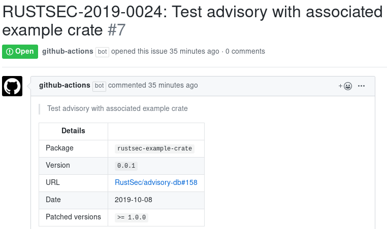

# Rust `audit-check` Action


> Security vulnerabilities audit

This GitHub Action is using [cargo-audit](https://github.com/RustSec/cargo-audit)
to perform an audit for crates with security vulnerabilities.

## Usage

### Audit changes

We can utilize the GitHub Actions ability to execute workflow
only if [the specific files were changed](https://help.github.com/en/articles/workflow-syntax-for-github-actions#onpushpull_requestpaths)
and execute this Action to check the changed dependencies:

```yaml
name: Security audit
on:
  push:
    paths: 
      - '**/Cargo.toml'
      - '**/Cargo.lock'
jobs:
  security_audit:
    runs-on: ubuntu-latest
    steps:
      - uses: actions/checkout@v4
      - uses: rustsec/audit-check@v2.0.0
        with:
          token: ${{ secrets.GITHUB_TOKEN }}
```

It is recommended to add the `paths:` section into the workflow file,
as it would effectively speed up the CI pipeline, since the audit process
will not be performed if no dependencies were changed.


In case of any security advisories found, [status check](https://help.github.com/en/articles/about-status-checks)
created by this Action will be marked as "failed".\
Note that informational advisories are not affecting the check status.


#### Granular Permissions

These are the typically used permissions:

```yaml
name: 'rust-audit-check'
github-token:
  action-input:
    input: token
    is-default: false
  permissions:
    issues: write
    issues-reason: to create issues
    checks: write
    checks-reason: to create check
```

The action does not raise issues when it is not triggered from a "cron" scheduled workflow.

When running the action as scheduled it will crate issues but e.g. in PR / push fails the action.

#### Limitations

Due to [token permissions](https://help.github.com/en/articles/virtual-environments-for-github-actions#token-permissions),
this Action **WILL NOT** be able to create Checks for Pull Requests from the forked repositories,
see [actions-rs/clippy-check#2](https://github.com/actions-rs/clippy-check/issues/2) for details.\
As a fallback this Action will output all found advisories to the stdout.\
It is expected that this behavior will be fixed later by GitHub.

## Scheduled audit

Another option is to use [`schedule`](https://help.github.com/en/articles/events-that-trigger-workflows#scheduled-events-schedule) event
and execute this Action periodically against the `HEAD` of repository default branch.

```yaml
name: Security audit
on:
  schedule:
    - cron: '0 0 * * *'
jobs:
  audit:
    runs-on: ubuntu-latest
    steps:
      - uses: actions/checkout@v4
      - uses: rustsec/audit-check@v2.0.0
        with:
          token: ${{ secrets.GITHUB_TOKEN }}
```

With this example Action will be executed periodically at midnight of each day
and check if there any new advisories appear for crate dependencies.\
For each new advisory (including informal) an issue will be created:



## Inputs

| Name        | Required | Description                                                                | Type   | Default |
| ------------| -------- | ---------------------------------------------------------------------------| ------ | --------|
| `token`     | ✓        | [GitHub token], usually a `${{ secrets.GITHUB_TOKEN }}`                    | string |         |
| `ignore`    |          | Comma-separated list of advisory ids to ignore                             | string |         |
| `working-directory`|   | The directory of the Cargo.toml / Cargo.lock files to scan.                | string | `.`     |

[GitHub token]: https://help.github.com/en/actions/configuring-and-managing-workflows/authenticating-with-the-github_token
